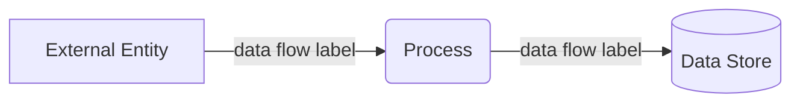
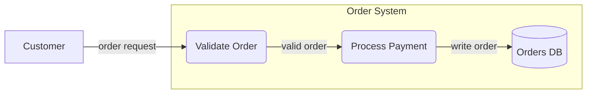
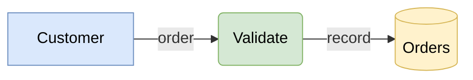
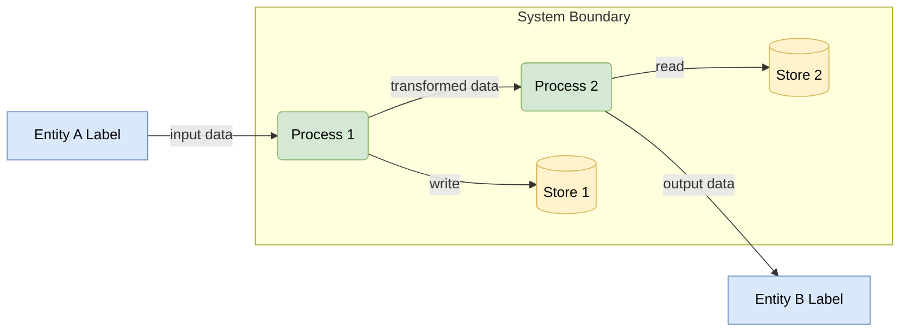

# DFD Notation Mapped to Mermaid Flowchart Syntax

## Core DFD Element Mapping

| DFD Element | Traditional Symbol | Mermaid Syntax | Visual Result |
|---|---|---|---|
| Process | Circle / rounded rectangle | `id(Label)` | Rounded rectangle |
| Data Store | Open rectangle / parallel lines | `id[(Label)]` | Cylinder |
| External Entity | Rectangle | `id[Label]` | Rectangle |
| Data Flow | Labeled arrow | `source -->|label| target` | Arrow with label |

## Node Shape Reference



## Direction

Use `graph LR` or `flowchart LR` for left-to-right layouts — most natural for DFDs showing data moving through a pipeline. Use `graph TB` or `flowchart TD` for top-down layouts with multiple parallel paths.

```
flowchart LR    %% left → right (default recommendation for DFDs)
flowchart TD    %% top → down (use when flows have many parallel paths)
```

## Subgraphs for System Boundaries

Subgraphs group elements visually and represent a system boundary (e.g., "inside our system" vs. "external").



Subgraph syntax:
```
subgraph id ["Display Label"]
    node1
    node2
end
```

## Styling with classDef

Define classes to visually distinguish DFD element types. Apply with `class nodeId className` or inline with `:::className`.



Recommended color scheme:
- **External entities** — blue: `fill:#dae8fc,stroke:#6c8ebf`
- **Processes** — green: `fill:#d5e8d4,stroke:#82b366`
- **Data stores** — yellow: `fill:#fff2cc,stroke:#d6b656`

## Data Flow Arrow Variants

| Arrow Type | Syntax | Use When |
|---|---|---|
| Standard flow | `A -->|label| B` | Normal data movement |
| Thick flow (high-volume) | `A ==>|label| B` | High-volume or critical path |
| Dotted flow (async/optional) | `A -.->|label| B` | Asynchronous, optional, or inferred flow |
| Bidirectional | `A <-->|label| B` | Rarely used — DFDs prefer explicit directional flows |

## DFD Levels

| Level | Scope | What to Show |
|---|---|---|
| Level 0 (Context) | Entire system as one process | External entities + major data flows in/out |
| Level 1 | Top-level sub-processes | Internal processes, data stores, flows between them |
| Level 2+ | Decomposed sub-process | Further decomposition of one Level 1 process |

Rule: Every data flow entering a Level 0 process must appear at Level 1. Every data store referenced in a sub-process must appear in its parent level.

## Complete Syntax Template


