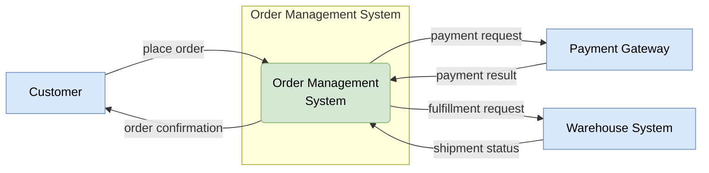
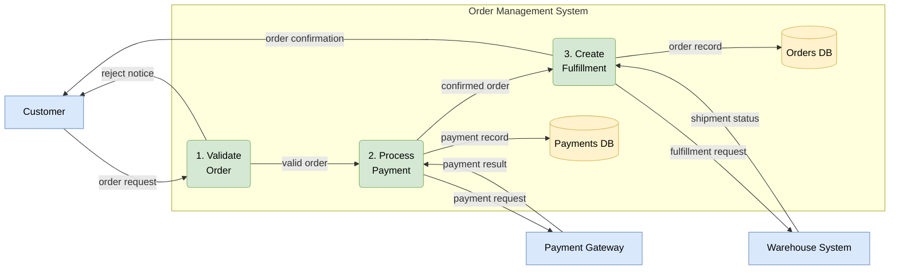
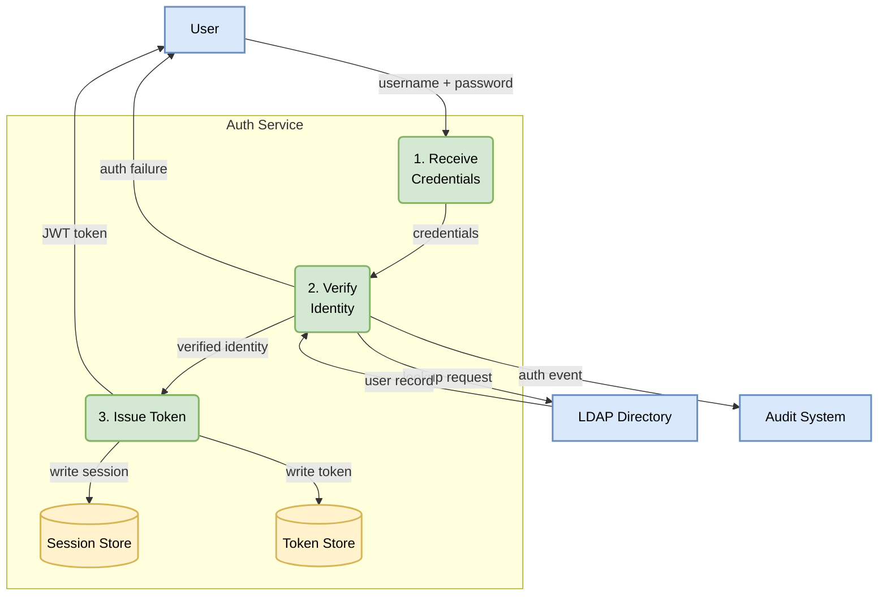
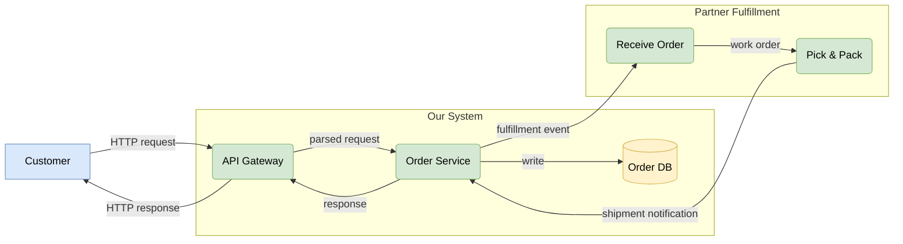

# DFD Examples

## Example 1: Context-Level DFD (Level 0)

The system is a single process node. Show all external entities and the major data flows crossing the system boundary. No internal detail.

**When to stop at Level 0:** When the audience needs only the system boundary and external actors — useful for scope discussions, threat modeling (STRIDE trust boundary identification), or executive communication.

---

## Example 2: Detailed DFD (Level 1)

Decompose the single context process into sub-processes. Every data flow from Level 0 must enter or leave the boundary. Data stores appear here.

---

## Example 3: Styled DFD with classDef

Full styling to distinguish element types at a glance. This example models a user authentication flow.

---

## Example 4: Multi-Boundary DFD

When a system integrates with a partner system that also has internal structure worth showing, use nested or adjacent subgraphs.

